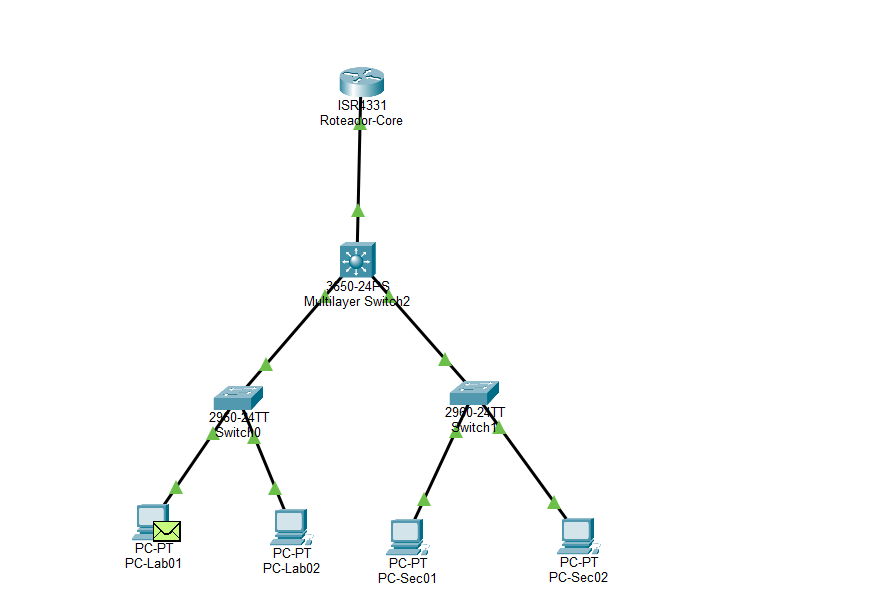
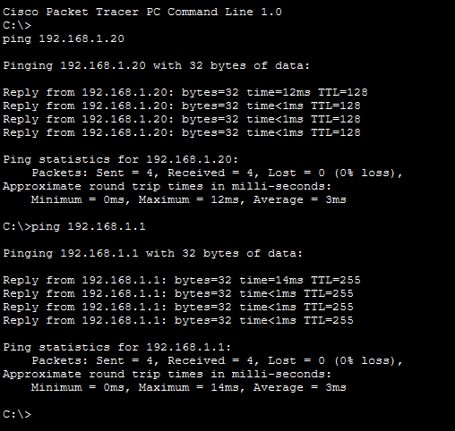
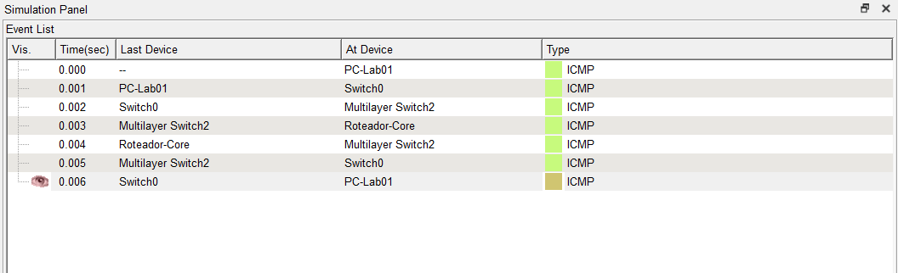

# Lab 04 - Redes Hierárquicas

## Objetivo

Esta atividade teve como objetivo compreender o modelo de redes hierárquicas, organizando uma infraestrutura em três camadas:

- Camada de Acesso
- Camada de Distribuição
- Camada de Núcleo (Core)

A prática foi desenvolvida no Cisco Packet Tracer, realizando a montagem da topologia, configuração básica do roteador, endereçamento IP dos dispositivos e testes de conectividade.

---

## Topologia

Foram utilizados os seguintes equipamentos:

- 1 Roteador Cisco 4331 (Core)
- 1 Switch Cisco 3650 (Distribuição)
- 2 Switches Cisco 2960 (Acesso)
- 4 Computadores

### Estrutura da rede

```
PCs
 │
Switches de Acesso
 │
Switch de Distribuição
 │
Roteador Core
```

---

## Configuração realizada

- Montagem da topologia
- Configuração do endereço IP dos computadores
- Configuração da interface GigabitEthernet0/0/0 do roteador
- Ativação da interface com `no shutdown`
- Testes de conectividade utilizando o comando `ping`
- Verificação da comunicação utilizando o modo **Simulation** do Packet Tracer

---

## Resultados

Os testes de conectividade foram concluídos com sucesso, demonstrando que os dispositivos conseguiram se comunicar corretamente através da estrutura hierárquica da rede.

---

## Evidências

### Topologia da rede



### Teste de conectividade (Ping)



### Painel de Simulação



---

## Tecnologias

- Cisco Packet Tracer
- Redes de Computadores
- Modelo Hierárquico de Redes
- IPv4
- ICMP